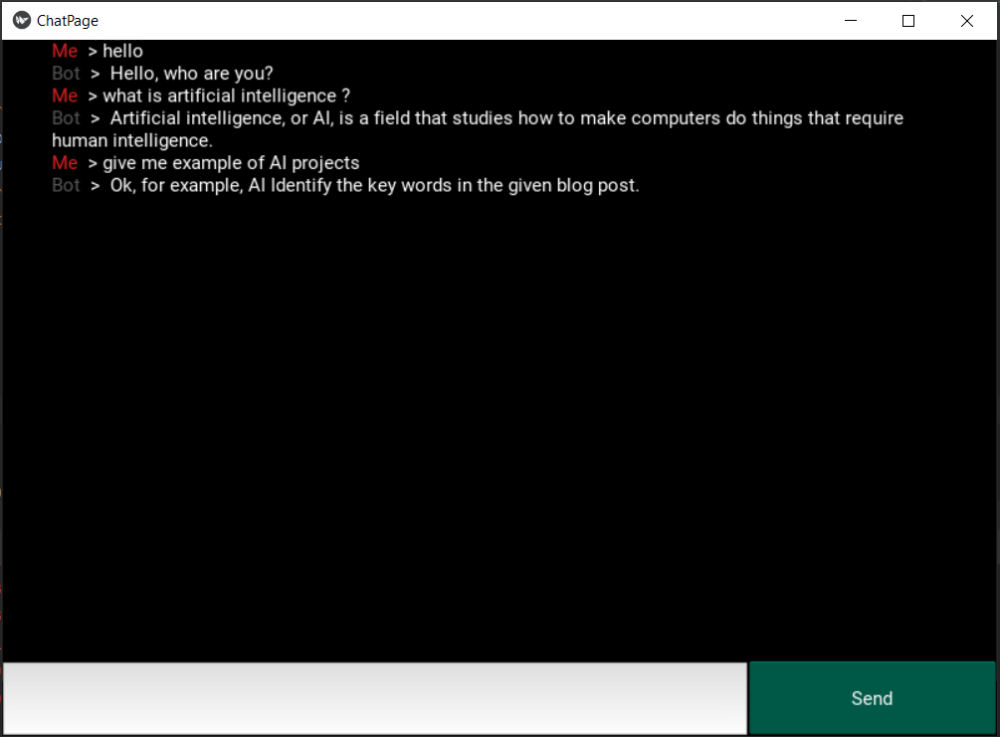

# OpenAI Chatbot Interface

Welcome to the OpenAI Chatbot Interface – an intelligent desktop application built with the Kivy package that harnesses the power of OpenAI's GPT-3 model (Davinci). With this chatbot interface, you can have interactive and intelligent conversations with the chatbot, making it a versatile tool for various applications.

  

## Features

- **Conversational AI:** Engage in natural and dynamic conversations with the OpenAI GPT-3 model (Davinci).

- **User-Friendly Interface:** An intuitive and easy-to-use desktop application.

- **Customizable Responses:** Tailor the chatbot's responses to suit your specific use cases.

- **Rich Output:** Receive text-based responses, making it ideal for integration into other applications.

- **Versatile Use Cases:** Use it for content generation, customer support, creative writing, and more.
